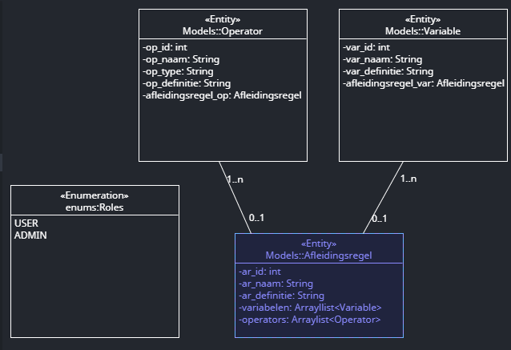

# LinkeXtractor

## Setup
Voor dat aan dit project gewerkt kan worden zijn een aantal zaken belangrijk om te weten:

1. Dit project gebruikt Vue(Javascript/typescript/node.js) voor de frontend en Spring boot(java/maven) voor de backend.
2. Voor dit project is het dus een vereiste om node.js, maven en java op het systeem te hebben geinstalleerd.
3. Voor testing is vitest gebruikt
4. Voor het deployen is heroku en docker gebruikt

## Frontend
De frontend kan worden opgestart met de commando npm run dev, hiermee wordt de development omgeving aangeroepen. Vervolgens zijn een aantal zaken belangrijk om te weten:
1. Om te loggen binnen de applicatie moet men de volgende url opzoeken localhost:8080/login
2. Vervolgens kan een gebruiken een xml inladen in de XmlLoader.vue component. 
3. Als dit is gedaan wordt de content van het xml bestand ingeladen in de XmlDashboard.vue component.
4. Tenslotte wordt de XMLbronTimeLine component zichtbaar waarin een tijdlijn zichtbaar wordt met alle bewerkingen van de ingeladen artikel
5. Refereer naar het onderstaande sequence diagram om te zien welke functies precies worden aangeroepen.
 

6. Tenslotte is er gebruik gemaakt van Pinia (te vinden in app.js) voor state-management. De redenen waarom zijn:
-  Het gebruiken van een store zorgt ervoor dat we vaak maar 1 keer een API endpoint hoeven aan te roepen om data op te vragen. Dit doen we om performance en consistentie van data en deze applicatie te waarborgen.

## Backend
De backend kan worden opgestart door de main functie aan te roepen binnen BackendApplication.java 

Vervolgens worden de classes (entities) opgehaald en worden daarvoor tabellen gemaakt in de database die geconfigureerd kan worden in applications.properties (zie hieronder de class diagram, de diagram is ook een erd).

Hierna moet worden ingelogd op de volgende API endpoint: POST localhost:8085/auth/login met de volgende gegevens

``json
{
    "username": "johndoe",
    "password": "password"
}
``

De response zal de volgende drie items bevatten:
- de username
- een accesstoken(JWT Token)
- een refreshtoken(RSAKey)

De JWT Token moet altijd worden meegegeven als een Bearer token:

Hierna kunnen API endpoints aangroepen worden en krijg je een 200 of 202 response. 

## Endpoints
Hieronder een lijst van endpoints die vaak gebruikt worden binnen de applicatie:

- **/auth/login POST. Login endpoint
- **/XMLBron/api/v1/timelineData/{articlenaam} GET. Endpoint voor ophalen van tijdlijndata 
- **/define/deleteDefinition/{definitionId} DELETE. Endpoint voor verwijderen van definities
- **/XMLBron/ByName/{articlenaam}/{xmlbronDate} GET. Endpoint voor het ophalen van een artikel op basis van naam en datum
- **/define/getDefinitions/{xmlbronnaam}/{username}/{xmlbrondate} GET. Endpoint voor het ophalen van definities op basis van artikelnaam, gebruikersnaam en artikeldatum.
- **/label/getLabels/{xmlbronnaam}/{username}/{xmlbrondate} GET. Endpoint voor het ophalen van labels op basis van artikelnaam, gebruikersnaam en artikeldatum.

## CI/CD
tobewritten

## Dependencies
Dit project gebruikt de volgende dependencies:

### Frontend
(package.json)
- Vue
- Vuetify
- Jest
- Pinia
- xmlformatter
- Jquery
- axios
- Babel

## Backend
(pom.xml)
- maven
- Bucket4J
- Spring security
- Oauth

## CI/CD
(docker.compose.yml en git.yml)
- Docker
- Sonarqube
- Gitlabrunner
- Heroku